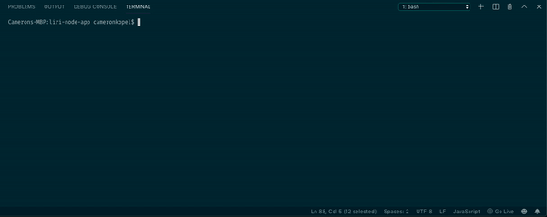
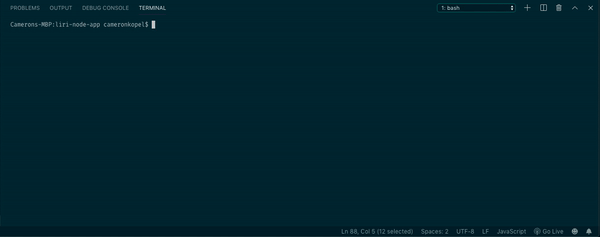
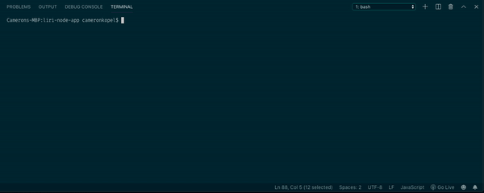
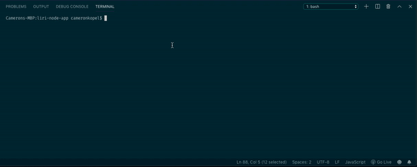

# Liri-Node-App

This is a Node.js app that takes user input from the CLI and searches for info on movies, songs on Spotify, and upcoming concerts.

## Technologies Used

  ### Modules Used

  - Axios for API calls
  - Node-Spotify-API for simplifying the API call for songs.
  - Moment.js for datetime structuring
  - DotEnv for management of keys and secrets.
  - Node's core Fs module

  ### APIs used

  - Spotify
  - Bands In Town
  - OMDB 

## How this app works

This app takes arguments from the command line for it's four functions. It looks at process.argv[2] for which function to call, and it takes any further array items as arguments for that function.

**Note,** If you plan to clone this, you will need to add a .env file with a Spotify key and secret for it to function as intended.


## Using Liri

### Spotify
This function searches spotify for a song.

It will return:

1. Artist
2. Song
3. Preview link
4. Album

The syntax to use the spotify song search is:
```javascript
node liri spotify-this-song <song>
```
Spaces are accepted. If correct, it will function as shown below.


### Movie Search

This function seaerches the OMDB database for a movie and returns:

1. Title
2. Year
3. IMDB Rating
4. Meta Rating
5. Country produced in
6. Language
7. Plot
8. Actors/Actresses

The syntax to use the movie search is: 
```javascript
node liri movie-this <movie>
```
Spaces are accepted. If correct, it will function as shown below.


### Concert Search

This function uses the Bands In Town API to search for upcoming concerts and returns:

1. Venue
2. Location
3. Date and time (formatted into MM/DD/YYYY hh:mm using Moment.js)

The syntax to use the movie search is: 
```javascript
node liri concert-this <artist/band>
```
Spaces are accepted. If correct, it will function as shown below.



### Do-What-It-Says

This function uses the Fs module to read inside the random.txt, and accept the contents as Liri would accept a command line argument.

This will use whatever is saved into the random.txt file, and but is initially set to just use the Spotify search for I Want It That Way by the Backstreet Boys.

The syntax to use the movie search is: 
```javascript
node liri do-what-it-says
```


